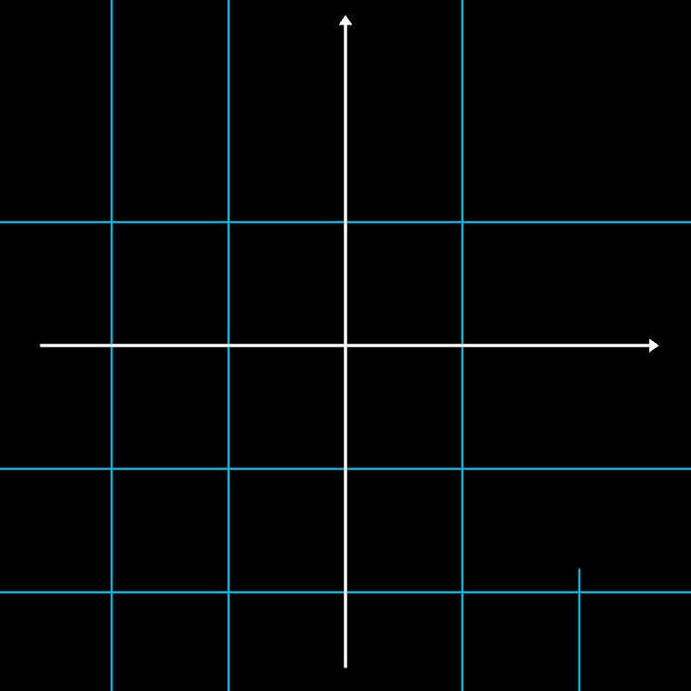

# Axes

The coordinate frame of video-01, grid and all — a symbolic holon: the
CPU decides what exists, `compose()` runs once. Per axis letter in
`mode`, one arrowed axis line plus, per `drawGrid`, grid lines at every
`gridSpacing` (half the axes' stroke width, in `gridTint`). Creation is
pydeation's domino: axes draw first, the lattice cascades in behind
them, each line more eased than its window suggests (the stale
rel_duration, pinned in tests). UnCreate is built on Erase, not UnDraw
— the lattice sweeps away ahead of the line.

**Promoted params**: `mode`, `xStart/xEnd/yStart/yEnd/zStart/zEnd`,
`gridSpacing`, `gridLineLength`, `drawGrid`, `drawTicks`, `arrowEnd`,
`arrowSize`, `gridTint`, plus the Stroke set.

**Lineage**: pydeation `custom_objects.py` (Axes) and the Domino timing
algebra (`animator.py`). Proven by the S02/S04/S05/S06/S08 gauntlets
and `test/vocab.test.ts` (cascade easing, Erase asymmetry).

**Parts**: primitives only — generated Lines.
