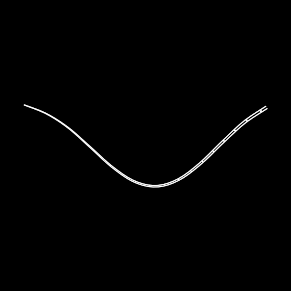

# Cable

ONE holon whose identity is the rendered face — a tapered tube drawn as
its two silhouette edges, with contour rings born at the head every
`ringStep` of travel and receding down the tube — and whose context
supplies the control-polyline source. Two sources ship: `trail()`, the
carrier's own past sampled purely ({position(T−s)}, no recorded
history, scrub-safe both directions), and `tether()`, the XPBD chain of
TheWall — history-dependent, so it does the one thing ONTOLOGY
sanctions: bakes once at build time, after which geometry at clock t is
a table lookup.

**Promoted params**: `width`, `taper`, `ringStep`, `window` (trail
seconds), `clock`, `rings`, plus the Stroke set.

**Lineage**: the DECISIONS 2026-08-29 cable verdict; MindVirus.py's
tracer/sweep generator (trail) and TheWall.py:1404-1560 (tether).
Proven by `test/cable.test.ts` (purity, taper, ring drift) and the
mindvirus/thewall composites in docs/reports/wall/.

**Parts**: primitives (edge Lines + ring pool); leans on
`src/geometry/xpbd.ts` and `src/bake.ts` for the tether.
