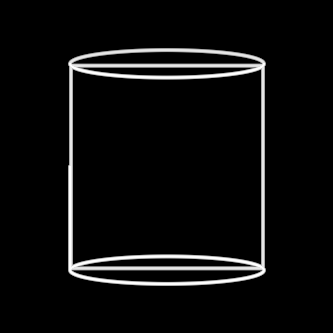

# Cylinder

The star of the 2021 vocabulary and the founding benchmark of the whole
framework: a cylinder born of a square and a circle. Its wireframe is
entirely view-dependent — two cap circles (always full, no hidden-line
removal, the 2021 look) plus two mantle silhouette generators computed
analytically per frame from the camera. Draw-on runs the four strokes
as one pen, arc-length-proportioned, like Sketch & Toon's "single"
stroke method.

**Promoted params**: `radius` (50), `height` (200), plus the Stroke set
(`tint`, `stroke`, `creation`, `erasure`, `drawStart`, `drawReversed`).

**Lineage**: C4D's own defaults, deliberately matching video-01
(pydeation `custom_objects.py`); silhouette math in
`src/render/silhouette.ts`. Proven by the S01/S03/S05/S06/S09/S10
gauntlets (docs/reports/video-01.md, DECISIONS on the five-stroke
cylinder and arc order) and the founding parable (`holons/Cylinder` —
the `founding` scene, which this face is rendered from).

**Parts**: primitives only (a leaf symbol).
