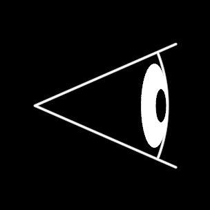

# Eye

The creature of video-01 — the "circler" and "rectangler" who watches
the dialectic unfold. The Observer presents as the Eye (ONTOLOGY.md).
Two lid rays from the apex, opened ±22.5°; the eyeball arc spanning the
same fan (the lids deliberately overshoot past it — the little tick at
the tips); iris and pupil as filled ellipses. CreateEye draws the lids
as ONE stroke — the pen runs the upper lid in to the apex and back out
along the lower — and UnCreateEye takes the look before the shape.

**Promoted params**: `opening` (lid half-angle scale), plus the Stroke
set (`tint` binds lids, eyeball and iris; the pupil stays black).

**Lineage**: pydeation `custom_objects.py:79-80` (the three-point lid
spline), `animator.py` CreateEye/UnCreateEye dispatch. Proven by the
S01/S02/S08 gauntlets and the Create-choreography tests
(`test/vocab.test.ts`).

**Parts**: primitives only — 2 Lines, an Arc, 2 filled Ellipses.
