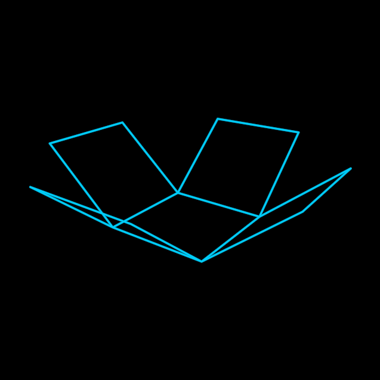

# FoldableCube

The narrative container of the TheWall holarchy: five square faces, an
open top, and one Bipolar degree of freedom. At fold 1 the wireframe
reads as a complete cube — the open cup whose missing top the trapped
mind doesn't see. At fold 0 it lies flat, the unfolded cross; at −1 the
walls fold through, wrapped around whatever the cube was pressed
against. The four side faces hang on pivot Groups sitting ON the bottom
face's edges, so the hinge line IS the shared edge — exactly the C4D
original's construction.

**Promoted params**: `size` (edge length), `fold` (−1…1), plus the
Stroke set. The hinge law is exported once as `hingeAngle(fold)` —
shared with the XPBD tether's collision cube (`src/geometry/xpbd.ts`).

**Lineage**: TheWall/DreamTalk `custom_objects.py:1452` (FoldableCube),
verified against MindVirus.mp4's jellyfish pulse frames. Proven by
`test/foldablecube.test.ts` (adjacent corners meet exactly at ±1).

**Parts**: primitives only — 5 Rectangles on 4 hinge Groups.
