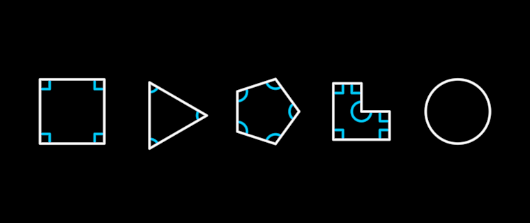

# GeometrySketch — a shape's angles, annotated



The second pluggable ability (Morph's template, DECISIONS 2026-09-07).
Hand it any line or shape and it runs its own logic: it finds the shape's
**sharp angles** and annotates them as a geometer would — the little
square-corner mark where the angle is 90°, an arc across every other one.
A square gets four squares, a triangle three arcs, a pentagon five; a
custom outline gets whatever corners it really has (a concave notch gets
an arc sweeping the long way round, INSIDE the shape); a circle gets
nothing, because it has no angle to show. ONTOLOGY.md 2026-09-16: the
SQUARE side of "both creatures describe the mathematics of what they see".

```ts
import "../../vocabulary/GeometrySketch/GeometrySketch"   // every Stroke learns it
import { GeometrySketch } from "../../vocabulary/GeometrySketch/GeometrySketch"

class MyDream extends Dream {
  square = new Square({ size: 200 })
  marks = new GeometrySketch(this.square, { tint: BLUE, size: 24 })  // the noun
  // or: staged = this.square.sketchGeometry({ tint: BLUE })        // the method
  unfold() {
    this.play(Create(this.square), 2)
    this.play(Create(this.marks), 1.5)
  }
}
```

The face is `/demo/?scene=geometrysketch` at t = 3.9 s: square, triangle,
pentagon, a concave hand-made outline, circle — the same sketcher on all
five.

## How it decides

- **Corner**: a vertex where the pen turns ≥ 20° (`SHARP_TURN`). Curves
  sampled for the screen turn a few degrees per vertex, so circles and
  rounded corners carry no marks.
- **Inside**: a closed outline's own orientation (Newell's normal) says
  which corners are convex and which reflex; an open line shows each
  corner's smaller angle. Works in 3D — tilt the shape and the marks stay
  in its plane.
- **Size**: `size` (24) is the square's side and the arc's radius, never
  more than 35% of the shorter adjacent edge.

## What lives where

| Piece | Where |
|---|---|
| The mathematics (corners, interior side, square, arc) | `src/geometry/angles.ts` |
| The holon — marks as Lines, derived live from the shape's WORLD outline, at the scene root like a MorphShape | here |
| The verb | `Create(sketch)` — annotating needs no timing of its own |
| The graft — `.sketchGeometry()` on every Stroke | here |

The sketch is an agent that LOOKS at the shape (ONTOLOGY 2026-09-17), a
sibling in the scene, not a part of it: move, turn, tilt or resize the
shape and the marks follow. Its mark pool is sized when it is built — a
shape that later gains corners shows only the first ones.

**Gate**: anything with one outline (Circle, Ellipse, Square, Polygon,
Rectangle, a Line of ≥ 2 points); composites like AnnularSector are
refused at construction with a teaching error. `isSketchable()` asks
without throwing.

**Proven by**: `test/geometry-sketch.test.ts` (15 tests: right angles,
true interiors of triangle/pentagon, no marks on curves, the reflex
notch inside the L and the angle sum, winding independence, open lines,
a tilted square's marks in its plane, live following, the gate, the
graft) and the `geometrysketch` scene.
