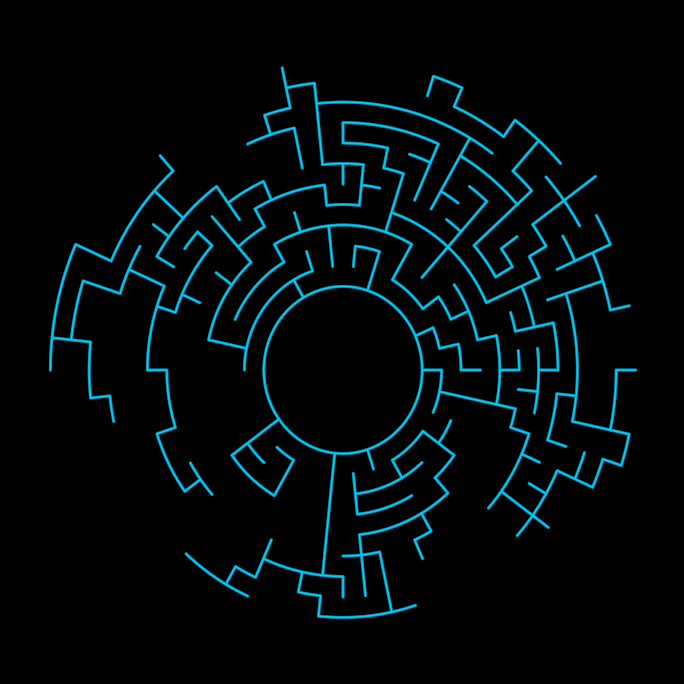

# Labyrinth

The outermost symbol of the TheWall holarchy: a circular maze grown
outward from a closed citadel circle, its rim open to the world and its
core unreachable. Like Axes, a symbolic holon — the CPU decides what
exists (the maze math lives in `src/geometry/labyrinth.ts`), and
Create draws the citadel first — the maze is a gift that grows FROM the
citadel — with the wall chains radiating outward as a domino cascade.

**Promoted params**: `radius` (the open rim), `citadelRadius`,
`cellSize` (40 reproduces TheWall.png's measured 12 rings), `seed`
(same seed, same labyrinth), plus the Stroke set (`tint` BLUE).

**Lineage**: TheWall/TheLabyrinth.py; the canonical TheWall.png is
actually THIS symbol's face plus the MolochEye and eight red spirals
that belong to other holons (wall-stack-study §Layers). Proven by the
sidebyside comparisons in docs/reports/wall/
(labyrinth-sidebyside-cell40.png) and `test/labyrinth.test.ts`.

**Parts**: primitives only — the citadel Circle (its radius stays live)
and settled Line chains.
