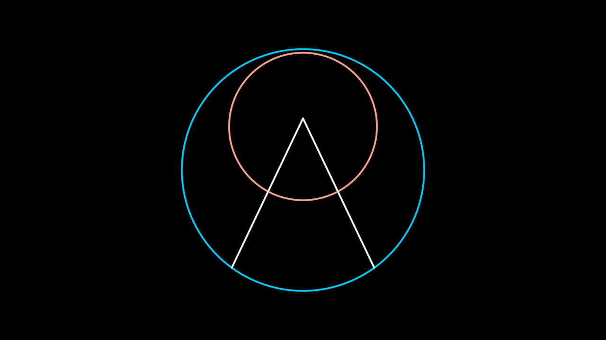

# Logo

The Project Liminality brand mark. A blue circle; a red circle riding
high inside it; and a white "Λ" whose legs stand on the blue rim and
meet just above the red circle's centre — the liminal threshold, the
gateway drawn inside the whole.

The construction's single unit is `radius`, the main circle's, and
every other proportion is a fraction of it: the small circle is
`0.61·radius` with its centre `radius − smallRadius − 6` up (so the two
circles nearly kiss at the top, six units short); the legs stand at
`−π/2 ± π/5` on the rim and converge on a focal point
`0.11·smallRadius` above the small circle's centre. The three
decimals — 0.61, the −6, 0.11 — are the 2024 source's own named values,
a designer's three decisions, carried verbatim rather than
rationalised. Nothing here is measured off a frame.

**Promoted params**: `radius` (the unit), `tint` (the main circle),
`smallTint` (the small circle), `lineTint` (the Λ), plus the Stroke
set. Resize through `scale`, which is how every source instance does it
(`Logo(z=50, scale=0.6)`, `Transform(logo, scale=5/4)`).

**The choreography is not a draw.** `Create(logo)` dispatches
pydeation's dedicated `CreateLogo`, not a generic parallel draw-on:
the main circle **fades** in over (0, 0.4); the legs **draw upward**
from their feet over (0.4, 0.7); and over (0.7, 1) the small circle is
**born at the apex** — opacity, radius 0 → full, and height falling
from the focal point to its own centre, all at once. It swells out of
the gateway and settles into place. `UnCreate` runs the source's own
reverse order (small circle out first, then the legs, then the main
circle), which is not `createAnim` mirrored.

**Lineage**: `refs/pydeation-legacy/object/custom_objects.py:115-146`
(the geometry) and `animation/animator.py:774-836` (`CreateLogo` /
`UnCreateLogo`), from the 2024 pitch "The Origins of Project
Liminality". Staged by `pitch.py` Scene05, 06, 08, 08_2 and 09.

**Proven by**: `test/logo.test.ts` (22 tests — the derivations
recomputed from the source's own relations, the legs' convergence
**solved** rather than compared, and both animators' windows pinned),
plus the scene scores against `refs/pitch/origins/frames5` —
`?scene=o05` 30/30 PASS (mean coverage ref 0.9988 / ours 0.9876) and
`?scene=o09` 25/26 (0.9942 / 1.0000), the one exception being the
bloom's first frame at 18s. See `docs/reports/origins/o3-*`.

**Parts**: primitives only — two Circles and two Lines.
