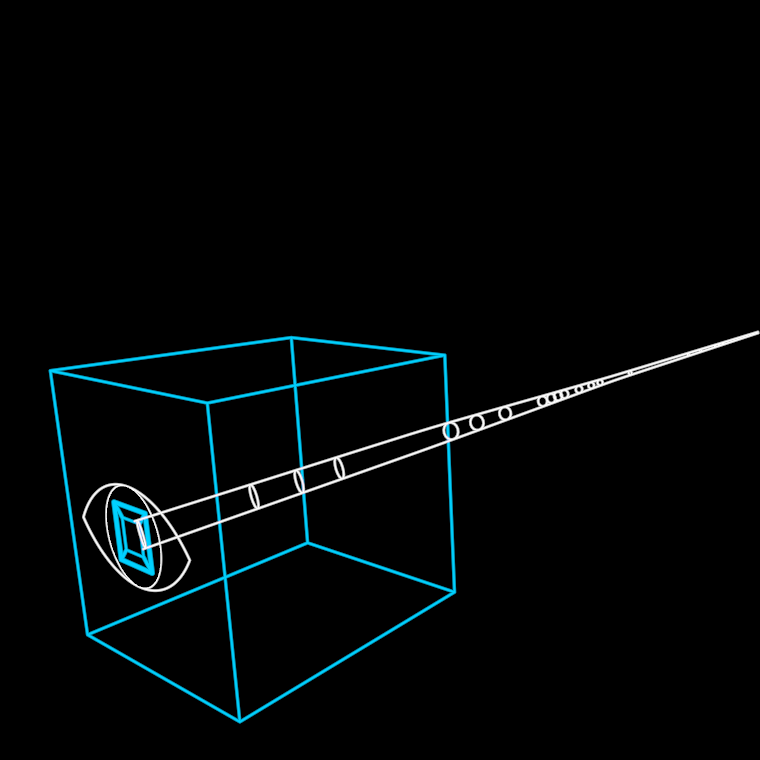

# MindVirus

A manipulative narrative that controls and extracts energy. The eye
sees; the cube entraps. The creature swims by jellyfish pulse — OPEN
(the bell spreads, almost no headway), THRUST (it snaps shut, the burst
of speed), GLIDE — stated once as two pure functions that both
spellings of motion share: `thrustPulse()` for a free creature, and a
`journey` that derives the whole transform from `clock` so the trail
stays f(t). The PNG-as-eye ImagePlane hack of the original dies here:
the eye is the parametric MolochEye.

**Promoted params**: `fold` (−1 wrapped … 1 open), `clock`, `journey`
(origin + pulses), and `states` (idle / hunting / attached).

**Lineage**: TheWall/MindVirus/MindVirus.py (thrust_pulse
:1060-1125, trail generator :656-885). Proven by the overlay scores in
docs/reports/wall/mindvirus-scores.json (+ overlay PNGs) and
`test/mindvirus.test.ts`.

**Parts**: [MolochEye](../MolochEye/) (the gaze) +
[FoldableCube](../FoldableCube/) (the bell, open top aft) +
[Cable](../Cable/) (the trail) — the first true composite of the
vocabulary.
