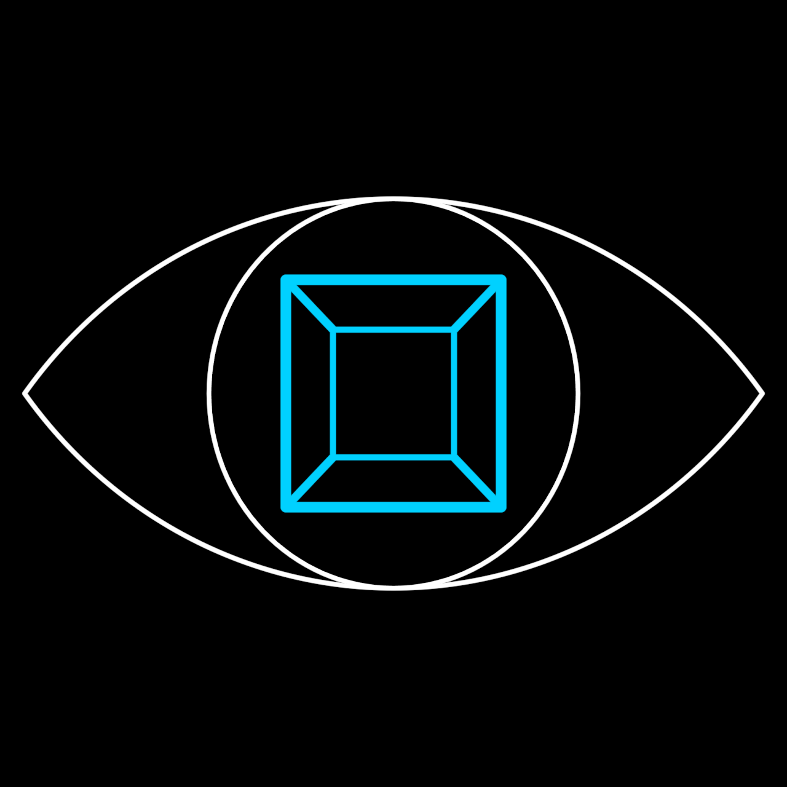

# MolochEye

The innermost symbol of the TheWall holarchy — the control mechanism's
gaze, rebuilt as a platonic construction. Pure lines plus exactly one
fill: the black disk that blots out whatever the eye sits on (the
sclera is transparent — on the black ground the symbol is only its
strokes). The construction's single unit is `height`, the lens
half-height; the lens arcs come from the 3-4-5 construction (each arc's
sine of half-span is 4/5) and the pupil cube's inner square from the
one-point-perspective factor k — never hard-coded.

**Promoted params**: `height` (the unit), `tint` (the pupil cube's
color — only the gaze is tinted), plus the Stroke set.

**Lineage**: the canonical face DreamTalkVocabulary/MolochEye/
MolochEye.png, measured at stroke centerlines; recipe in
docs/reports/wall-stack-study.md ("MolochEye — the platonic recipe").
Proven by the overlay PASS in docs/reports/wall/molocheye-final.png +
molocheye-report.json and `test/molocheye.test.ts`.

**Parts**: primitives only — Arcs, Circle, Square, filled Ellipse.
