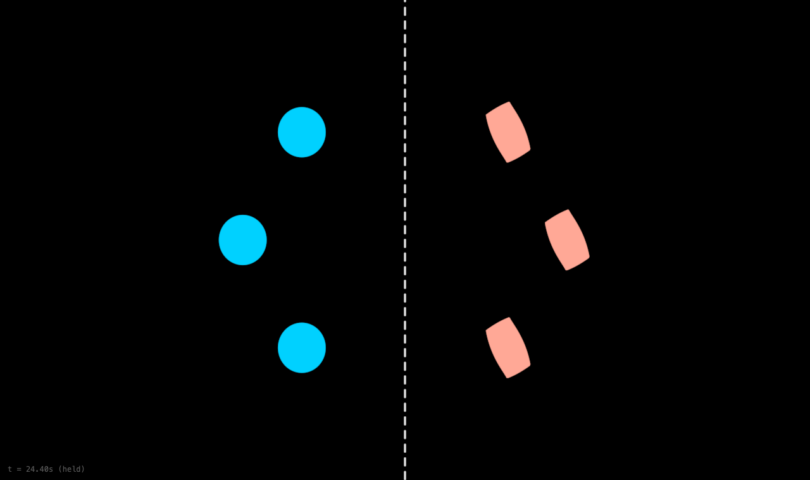

# Morph — the first pluggable ability



One shape becoming another. Import this module and every `Stroke` in the
process learns `.morphTo()`; don't, and nothing in the framework has ever
heard of morphing.

The face is Scene01 at t = 24.4s, mid-morph: three blue circles on the
left, and on the right three shapes that are no longer circles and not
yet rectangles — bowed, leaning, each skewed differently. A noun's face
shows the finished thing; an ability's face has to show the *becoming*,
because the becoming is what it contributes. Those leans are also the
correspondence proof — see below.

```ts
import { Morph, MorphShape } from "../../vocabulary/Morph/Morph"

class MyDream extends Dream {
  circle = new Circle({ radius: 50 })
  square = new Square({ size: 100 })

  // THE VERB SPELLING — the morpher is a declared field, like every
  // other holon, and the verb animates it.
  morpher = new MorphShape(this.circle, this.square, { opacity: 0 })

  // THE METHOD SPELLING — `.morphTo()` builds the morpher and hands it
  // back with its Anim. The scene still declares both; the method never
  // inserts geometry into the graph itself.
  becoming = this.circle.morphTo(this.square)

  unfold() {
    this.stage(this.morpher)
    this.stage(this.becoming.shape)
    this.play(Morph(this.morpher, this.circle, this.square), 4)
    this.play(this.becoming.anim, 4)
  }
}
```

Both spellings are canon and both are the same code. The verb suits a
scene that stages several morphers up front and animates them later
(Scene01 does exactly this); the method suits a morph stated in one
place, and is the reason the morpher comes back rather than being
conjured — a Dream's holons are its declared fields, so neither spelling
smuggles one in.

## What makes this different from every other vocabulary entry

The other twelve are **nouns** — Eye, Cylinder, Logo, MolochEye: things
you instantiate, that contribute geometry. Morph is a **verb**. Its
contribution is a capability the whole space gains by taking it in.

That distinction is the whole design. `Create`, `Draw` and `Fill` live in
`src/verbs.ts` because a Stroke that could not be drawn would be
incoherent — they are part of what a stroke *is*. A Stroke that cannot
morph is perfectly coherent; it is a Stroke in a world where nobody has
taught it that trick yet. So morphing is something a stroke **learns**,
through relationship, rather than something it is born knowing.

`src/verbs.ts` holds no implementation of this module. It carries one
temporary compatibility block — `Morph` was briefly a core verb before
the ability decision landed, so the old import path still resolves,
re-exported from here and marked for removal after a release. That shim
has one cost, stated where it lives: because verbs.ts is imported nearly
everywhere, the graft's runtime side effect reaches those files too, so
`.morphTo()` exists on Strokes in modules that never asked for it. The
*type* does not — a declaration merge only enters a compilation that
includes this module — so nothing can be written against it by accident.
When the block goes, so does the asymmetry.

## The four pieces

| Piece | Where | Why there |
|---|---|---|
| The mathematics | `src/geometry/morph.ts` | Pure functions over plain data — resampling, correspondence, interpolation. Core infrastructure, like `geometry/svg.ts`. Importing it grafts nothing. |
| The holon | `MorphShape`, here | Scene state. It stands in for both shapes while neither is itself. |
| The verb | `Morph()`, here | The timing — pydeation's AnimationGroup, ported. |
| The graft | one `defineProperty`, here | The teaching. |

## The correspondence rule (and why it is deliberately naive)

Both outlines are resampled to a common point count at uniform **arc
length**, then interpolated **index by index**. No rotation search, no
nearest-neighbour matching, no start-point alignment.

That is not a simplification — it is what pydeation did, because
pydeation did not solve correspondence at all. It handed the question to
Cinema 4D: two `MoSpline`s in Uniform mode (`SPLINE_MODE = 3`) feeding a
Cloner in Blend mode, driven by a PlainEffector's `modify_clone`
(`refs/pydeation-legacy/animation/animator.py:581-632`,
`object/mograph.py:37-54,118-151`).

The reference frames prove it. In "The Origins of Project Liminality"
(2024) at `f_00190`, three circles halfway into becoming rectangles are
**leaning, bowed quadrilaterals, each skewed differently** — exactly what
index-wise blending produces when two winding start points disagree. A
cleverer matcher would have made them upright. Anything cleverer here
would be a different animation from the one in the video.

## The eligibility gate, in two levels

**Compile time.** The `declare module` block merges `morphTo` onto
`Stroke` and only onto `Stroke`. `group.morphTo(…)` is a type error, not
a runtime refusal — a holon with no outline never will have one, and the
compiler is the right place to say so.

**Runtime.** Not every Stroke has a *single* outline. `AnnularSector`
draws itself through four sub-strokes; a `Line` of fewer than two points
has no shape at all. `MorphShape`'s constructor refuses both — at
construction, not at the first frame, so the stack trace names the line
in the scene that caused it.

Refusals **teach**, in the manner of the settled-holon error in
`holon.ts`:

```
Morph: cannot use AnnularSector as the source — a morph interpolates ONE
closed outline into another, and AnnularSector has no single outline of
its own: it draws itself through 4 sub-strokes. That is a category error
rather than a missing feature — morph its pieces individually, since each
sub-stroke is morphable on its own. Morphable shapes are: Circle,
Ellipse, Square, Polygon, Rectangle, or a closed Line.
```

The message distinguishes *category error* from *missing feature*, which
is the distinction a caller actually needs, and the degenerate case gets
its own wording (an empty `Line` is told to be given its points, not to
be taken apart). `isMorphable(holon)` answers the same question without
throwing, for code that would rather ask than catch.

The composite rule is pydeation's own, arrived at by omission:
`Morph.__new__` reaches straight for `start_spline.sketch_mat` and wraps
one `MoSpline(spline)`. It never calls `Animator.flatten_input`, the
helper every *other* animator uses to unpack a Group into its components.

## Noun/verb duality

`Morph(shape, a, b)` and `a.morphTo(b)` are one implementation; the
method delegates to the function, and adds only the construction of the
morpher it returns. Use whichever makes the sentence's subject clear —
the corpus scenes mostly use the function form because pydeation's
grammar is a list of animators handed to `play()`, and a reproduction
should read like its source. A symbol describing what *it* does in its
own `createAnim()` wants the method form.

## Why the side-effect import is sanctioned here

Importing this module mutates `Stroke.prototype`. In almost any other
module that would be a bug. Here it **is the product**: a module whose
entire purpose is to teach an ability is doing exactly what its name
says. The header states it in the first three lines, and the graft is
idempotent and non-enumerable — a second import is a no-op, and `Holon`'s
field scan (which walks `Object.entries` of an instance) never sees it.

## Proven by

- `test/morph.test.ts` — 46 tests: arc-length resampling, index-wise
  correspondence (pinned *against* a rotation search), purity and
  scrub-symmetry, the two-level gate, the graft reaching pre-existing
  instances, and the two spellings building identical Anims.
- Scene01 of corpus #09 (`?scene=o01`) — six simultaneous morphs,
  14/29 PASS at 2s steps and 18/29 densely over the morph window;
  `docs/reports/origins/o6-o01-f_00190-composite.png` is the
  correspondence proof.

## The template — what a second ability module copies

Write a `Write`, or a steering behaviour, or a `Trace`, and this is the
shape:

1. **Pure maths to `src/geometry/`.** Anything that is a function of
   plain data belongs to core and grafts nothing. The test of whether
   something is "ability-shaped" is simple: does it hold scene state, or
   name a Param? Then it is the module's.
2. **Declare the merge narrowly.** Augment the *most specific* interface
   that can honestly carry the ability. Merging onto `Holon` when only
   strokes qualify throws away the compile-time half of your gate.
3. **Gate at construction, and teach.** Say what the caller passed, why
   it does not qualify, whether that is a category error or a gap, and
   what *does* qualify. Export the predicate (`isMorphable`) so callers
   can ask instead of catching.
4. **Graft with `defineProperty`, non-enumerably.** ES modules evaluate
   once, so no `hasOwnProperty` guard is needed for idempotence — a
   second import re-runs nothing, and even a forced re-evaluation would
   assign the same body. What the descriptor must carry is
   `enumerable: false` (the field scan walks `Object.entries`, and only
   Params and parts belong there) and `configurable`/`writable` (so the
   module stays re-loadable under a test runner's module cache).
5. **Export both spellings from one implementation.** The method
   delegates to the function. Two code paths would drift.
6. **Say the side effect in the first three lines of the header.** The
   exception to "no side-effect imports" holds only while it is
   announced.
7. **Prove it in a scene, not only in tests.** An ability nothing uses
   has not been shown to be separable.
