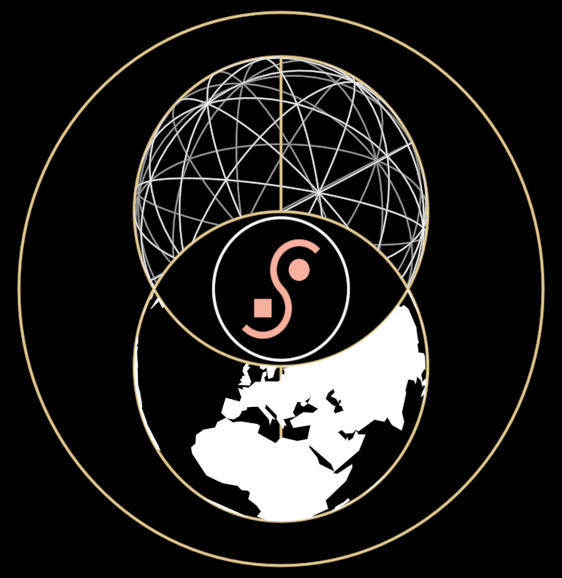

# Regenaissance

The noosphere stacked over the biosphere. Two equal circles on one
vertical axis, overlapping as a vesica piscis (each through the other's
centre): the top holds a lattice globe — the icosahedron's 15 great
circles, near face bright, far face dim — the bottom holds the Earth
(the `Globe` holon, Africa/Europe face). Where they overlap is the eye:
black, with a white ring holding the red `SMark`. One outer ring holds
the whole.

Source: the Regenaissance DreamNode (`WelcomeToTheRegenaissance.png`).
Its gold filigree frame — crown, rosettes, vines — is raster ornament and
is left out; the proportions (outer ring R; globes 0.56·R; mark ring
0.46·r) are measured from it, and stated in `Regenaissance.ts`.

**SMark** (`SMark.ts`) is its own sovereign holon: an S of two
point-symmetric semicircles that kiss at the centre, a dot at the upper
bowl's centre and a square at the lower's. Its real name was not found
in the vault (it also appears in MetaphysicalSymbiosis); it is named for
what it is.

**Promoted params**: `radius`, `latticeSpin` / `earthSpin` (the two
worlds turn independently), `mark` (presence) and `markTint`, plus the
ring/lattice tints and strokes. `?scene=regenaissance`; on the
whiteboard, `regenaissance` and `sMark`.
