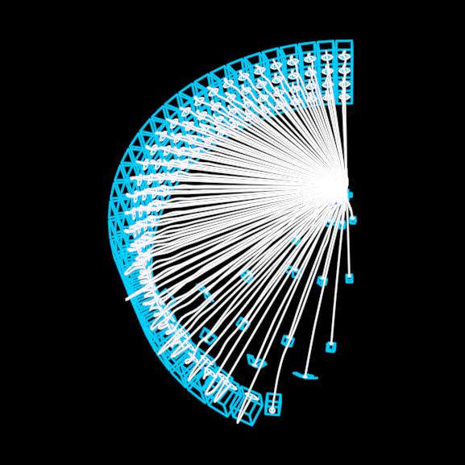

# TheWall

MindViruses self-assemble into a wall. Each creature flies its own
cubic Bezier from a shared spawn point to its slot along the footprint,
pulsing like a jellyfish, and folds shut into a brick when it arrives.
ONE parameter drives the whole thing: `growth`, a wave sweeping the
footprint, staggered row by row. The original's MoGraph blackboard
machinery (the hidden PackingLUT spline, name-lookup userdata) dies
here: packing is a pure function, and every creature is an ordinary
part. With `cables`, every creature gets its XPBD tether back to the
anchor — in the reference these white filaments ARE the image.

**Promoted params**: `growth` (THE parameter), `rowCount`, `rowHeight`,
`brickSize`, `rowLag`, `cables`, `sealAtOne`, `cableDuration`,
`cableFps`, `cableSlack`, `cableWidth`, and the `growthAt` seam.

**Lineage**: TheWall/TheWall.py (journeys :1283-1290, tethers
:1404-1560); the pure completion pipeline ports verbatim into
`src/geometry/journey.ts`/`packing.ts`. Proven by
scripts/wall-gauntlet.ts against refs/wall/thewall5 and the composites
in docs/reports/wall/ (dandelion moment: this face).

**Parts**: [MindVirus](../MindVirus/) × slots, each with its
[Cable](../Cable/) tether.
