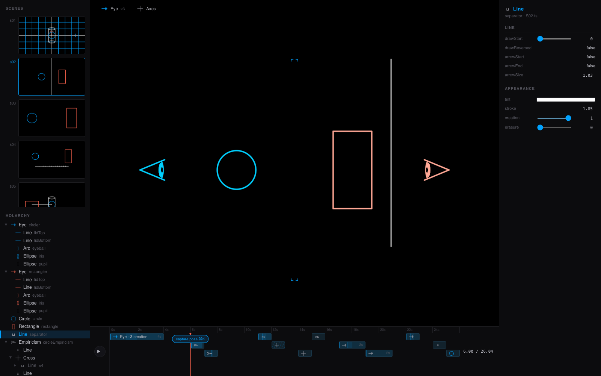
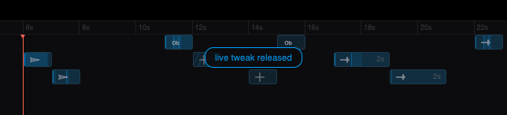
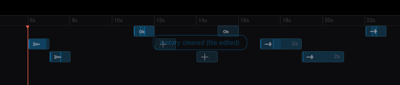

# Editor undo stack — design and verification

> The reflection's "biggest missing UX primitive", built. cmd+Z across
> the inspector, drag-move, timeline retiming and checkpoint capture;
> shift+cmd+Z redoes. Files: `core/editor/undo.ts` (pure + tested),
> `core/scripts/ops.ts` and `core/scripts/daemon.ts` (additive),
> `core/editor/main.ts` (the chords and the note),
> `core/test/undo.test.ts` (51 tests).

## The design: the daemon knows the inverse

An op's inverse is not something the editor has to reconstruct. The
DAEMON is the only party that sees the file both before and after a
write, so it computes the inverse at the moment of application and
returns it in the `opApplied` ack:

```
editor --{op, opId}--> daemon --applies--> file
editor <--{opApplied, opId, undo:{…the inverse op…}}-- daemon
```

Undo is then nothing but **sending that op back through the same
socket** — same queue, same ts-morph re-location, same rebase-onto-drift,
same ack. No file snapshots, no diff replay, no second code path that
could disagree with the first. Redo falls out for free and symmetrically:
the undo op is itself an op, so its ack carries an inverse, and that
inverse is exactly the thing that was undone.

### The inverse, per op

| op | what it replaced | inverse |
|---|---|---|
| `setOverride` (property existed) | the old literal | the same op carrying that literal |
| `setOverride` (property INSERTED) | nothing — it was absent | `deleteSpan` over the write's own diff |
| `setRunTime` | the old duration | the same op carrying it (an implicit `play(anim)` reads as its real 1s, not as "unreadable") |
| `setBackdrop` | the old spec | the same op carrying path + offset |
| `appendCheckpoint` | nothing — it inserts | `deleteSpan` over the exact regions written |
| `deleteSpan` / `insertSpan` | undo's own ops | each other, so undo is itself undoable |

Two decisions are worth naming.

**An inserted property needed the general path, not a "remove" flag.**
The most ordinary edit in the editor — dragging an object whose `x` the
scene never spelled — INSERTS `x: …`. A first attempt gave `setOverride`
a `remove: true` form, and it was wrong in a way the tests caught: writing
into a multi-line literal whose last property had no trailing comma also
ADDS that comma, so no single cut restores the prior bytes. The honest
inverse is the general guarded span-edit computed from the write's own
line-level diff, which describes every changed region including that
comma. `core/test/undo.test.ts` pins all six literal shapes the writer
emits.

**`deleteSpan` carries a LIST because a capture edits two places.** A
multi-target checkpoint writes the new `this.play(...)` statement AND
rewrites the import line to add `together`. An insertion-only diff calls
that "not contiguous" and gives up, which would make exactly the ops most
worth undoing the ones that cannot be. So the op is a list of guarded
edits — each `span` must still hold its `expect`, each becomes its
`replace` — applied all-or-nothing. Half an undo is a state nobody
authored.

**Refusal is a feature.** Where no inverse can be honest — a run_time
spelled as a named constant (`SIGHT_RUN_TIME`), a `setBackdrop` that
inserted the first backdrop line — the daemon returns no `undo`, and the
stack ENDS there rather than leaving a hole a later cmd+Z would step over
into a state that never existed.

## The two behavioural rules

**LIVE FIRST.** The live layer (EDITOR-V4) holds whatever the hand just
did and has not committed — a posed checkpoint, a flown camera, a
mid-drag tweak. That is the most recent edit, so cmd+Z releases it before
it reaches into the file's history. Undoing a committed op while a live
tweak still stands on screen would undo something the user is not looking
at. Only with nothing live does the stack pop. (`undoAction` in
`undo.ts`, tested without a browser; Case 4 below drives it for real.)

**CLEAR ON EXTERNAL EDIT.** Every inverse describes bytes that stood in a
file at a known moment. The daemon already distinguishes its own writes
from anyone else's (the watcher's echo suppression), so its reload now
says which it was; a reload caused by a write the daemon did not make
voids every inverse, and the stack clears and SAYS SO. `setOverride`'s
value-carrying inverses would often still "work" on drifted text — that
is precisely the danger. The note is parked across the reload the same
edit triggers, since the clear happens on the outgoing module and the
mount that reload builds is what displays it.

## Gates

- `bunx tsc --noEmit` — clean.
- `bun test` — **648 pass, 0 fail** across 38 files (565 baseline + 51
  new undo tests + other agents' work). `core/test/settled.test.ts` is
  another agent's in-progress `settled`-flag work and is excluded; its 4
  failures are theirs, in `core/src/holon.ts`, which this work does not
  touch.
- **S04 gauntlet: 6/6 frames PASS**, mean coverage ref=0.9946
  ours=0.9954 — matching the recorded baseline exactly
  (`s04-gauntlet.json`).

---

Driven through the real editor page against a real daemon on port 4350.
Scene: `core/demo/video01/S02.ts` at t=6s. Every "file diff" below is `diff -u` over the
scene file on disk, before and after the gesture.


---

## Case 1 — inspector override → cmd+Z restores the literal

Selected by viewport pick at NDC [-0.01,0.5]: **Line**
Its source anchor: `core/demo/video01/S02.ts:12820:12981`

Note S02 constructs `Eye` three times, so a drifted span could never be
rebased by class — the start-anchored match is what keeps this exact.


**The op** (`setOverride x=123.45`):

```diff
--- a/core/demo/video01/S02.ts
+++ b/core/demo/video01/S02.ts
@@ -326,6 +326,7 @@
     ],
     tint: WHITE,
     stroke: STROKE_GRID,
+    x: 123.45
   })
 
   // --- creatures ----------------------------------------------------
```
History after the op: `{"undo":1,"redo":0}`

**cmd+Z**:

```diff
--- a/core/demo/video01/S02.ts
+++ b/core/demo/video01/S02.ts
@@ -326,7 +326,6 @@
     ],
     tint: WHITE,
     stroke: STROKE_GRID,
-    x: 123.45
   })
 
   // --- creatures ----------------------------------------------------
```
Byte-identical to the pre-op file: **YES**
History after undo: `{"undo":0,"redo":1}`

**shift+cmd+Z** re-applied it byte-identically: **YES**
```diff
--- a/core/demo/video01/S02.ts
+++ b/core/demo/video01/S02.ts
@@ -326,6 +326,7 @@
     ],
     tint: WHITE,
     stroke: STROKE_GRID,
+    x: 123.45
   })
 
   // --- creatures ----------------------------------------------------
```

Back to baseline: **YES**

---

## Case 2 — drag-move commit (two ops) → cmd+Z each

A drag commits `x` and `y` as two separate ops against the same
construction. Two ops means two stack entries: cmd+Z twice.


**The drag's two ops** (`x=-222`, then `y=77`):

```diff
--- a/core/demo/video01/S02.ts
+++ b/core/demo/video01/S02.ts
@@ -326,6 +326,8 @@
     ],
     tint: WHITE,
     stroke: STROKE_GRID,
+    x: -222,
+    y: 77
   })
 
   // --- creatures ----------------------------------------------------
```
History after both ops: `{"undo":2,"redo":0}`

**cmd+Z once** (undoes `y`):

```diff
--- a/core/demo/video01/S02.ts
+++ b/core/demo/video01/S02.ts
@@ -326,8 +326,7 @@
     ],
     tint: WHITE,
     stroke: STROKE_GRID,
-    x: -222,
-    y: 77
+    x: -222
   })
 
   // --- creatures ----------------------------------------------------
```
Equals the state after only the x op: **YES**

**cmd+Z again** (undoes `x`):

```diff
--- a/core/demo/video01/S02.ts
+++ b/core/demo/video01/S02.ts
@@ -326,7 +326,6 @@
     ],
     tint: WHITE,
     stroke: STROKE_GRID,
-    x: -222
   })
 
   // --- creatures ----------------------------------------------------
```
Back to the pre-drag file: **YES**
History: `{"undo":0,"redo":2}`

Baseline restored: **YES**

---

## Case 3 — checkpoint capture → cmd+Z removes the inserted block EXACTLY

Live pose built: `[{"name":"x","value":250,"animated":false},{"name":"y","value":90,"animated":false}]`
Capture targets: `[{"path":"this.separator.x","value":250},{"path":"this.separator.y","value":90}]`

Capture op sent: `{"type":"op","op":"appendCheckpoint","file":"core/demo/video01/S02.ts","placement":"after","anchor":{"start":17606,"end":17812},"targets":[{"path":"this.separator.x","value":250},{"path":"this.separator.y","value":90}],"duration":1.5,"baseHash":"18c7ae8fc79b7c9ee804e4c4e3fb00f02ba3dc507383f6f7e1c5bbcd62175f80"}`

**The capture**:

```diff
--- a/core/demo/video01/S02.ts
+++ b/core/demo/video01/S02.ts
@@ -450,6 +450,13 @@
       ),
       4,
     )
+    this.play(
+      together(
+        this.separator.x.to(250),
+        this.separator.y.to(90),
+      ),
+      1.5,
+    )
     this.wait(2)
 
     // DrawSteady(sight_lines, draw_speed=200): a constant pen, so every
```
History after the capture: `{"undo":1,"redo":0}`

**cmd+Z**:

```diff
--- a/core/demo/video01/S02.ts
+++ b/core/demo/video01/S02.ts
@@ -450,13 +450,6 @@
       ),
       4,
     )
-    this.play(
-      together(
-        this.separator.x.to(250),
-        this.separator.y.to(90),
-      ),
-      1.5,
-    )
     this.wait(2)
 
     // DrawSteady(sight_lines, draw_speed=200): a constant pen, so every
```
The inserted block removed byte-exactly: **YES**

**shift+cmd+Z** put the block back byte-exactly: **YES**

Baseline restored: **YES**


*The posed frame, before the capture was written.*

---

## Case 4 — live-first: cmd+Z with an uncommitted tweak releases it

Live overrides standing (nothing committed): `[{"name":"x","value":400,"animated":false}]`
History depth: `{"undo":0,"redo":1}` — nothing on the stack.

After cmd+Z, live overrides: `[]`
The live layer was released: **YES**
The FILE was never touched: **YES**


*The status note after the live release — the editor's own transient
line, in the canonical blue.*

### …and with committed history present, the live layer still goes first

One op committed. History: `{"undo":1,"redo":0}`
A live tweak added on top: `[{"name":"y","value":55,"animated":false}]`

After cmd+Z — live overrides: `[]`, history: `{"undo":1,"redo":0}`
The FILE is untouched (the committed op is still there): **YES**

A second cmd+Z now reaches the file…
…and the file is back to baseline: **YES**

---

## Case 5 — clear-on-external-edit

One op committed. History: `{"undo":1,"redo":0}`

Now simulating a HAND EDIT — appending a comment line to the file:
```diff
--- a/core/demo/video01/S02.ts
+++ b/core/demo/video01/S02.ts
@@ -99,6 +99,7 @@
  * what says this is a constant offset and not accumulating drift, which
  * is the thing a per-play fudge would have hidden.
  */
+// a human edited this file
 const START_OFFSET = 0.035
 
 /** Half the diagonal contact offset: the circle's 45-degree point, 50/√2. */
```

History after the external edit: `{"undo":0,"redo":0}`
The stack cleared: **YES**
The note shown to the user: `{"text":"history cleared (file edited)","shown":false}`


*The note the external edit raises. It is PARKED across the reload the
same edit triggers — the clear happens on the outgoing module, and the
mount that reload builds is what says it.*

And cmd+Z now does nothing to the file rather than replaying a void inverse:
File unchanged after cmd+Z: **YES**

---

## The inverses the daemon computed, as they went over the wire

Each op's ack carries `undo`: a complete op descriptor holding the OLD
state. This is the whole design — undo sends one of these back through
the same socket, the same queue, the same re-location.

```json
verify-1: {"type":"op","op":"deleteSpan","file":"core/demo/video01/S02.ts","span":{"start":12977,"end":12991},"expect":"    x: 123.45\n"}

op-1: {"type":"op","op":"insertSpan","file":"core/demo/video01/S02.ts","at":12977,"text":"    x: 123.45\n","context":"  })\n\n  // --- creatures ----------------------------------------------------\n  //\n  // Eye(scale=0.3, x=-400, color=BLU","also":[]}

op-3: {"type":"op","op":"deleteSpan","file":"core/demo/video01/S02.ts","span":{"start":12977,"end":12991},"expect":"    x: 123.45\n"}

op-5: {"type":"op","op":"insertSpan","file":"core/demo/video01/S02.ts","at":12977,"text":"    x: 123.45\n","context":"  })\n\n  // --- creatures ----------------------------------------------------\n  //\n  // Eye(scale=0.3, x=-400, color=BLU","also":[]}

verify-2a: {"type":"op","op":"deleteSpan","file":"core/demo/video01/S02.ts","span":{"start":12977,"end":12989},"expect":"    x: -222\n"}

verify-2b: {"type":"op","op":"deleteSpan","file":"core/demo/video01/S02.ts","span":{"start":12977,"end":13000},"expect":"    x: -222,\n    y: 77\n","replace":"    x: -222\n"}

op-7: {"type":"op","op":"deleteSpan","file":"core/demo/video01/S02.ts","span":{"start":12977,"end":12989},"expect":"    x: -222\n","replace":"    x: -222,\n    y: 77\n"}

op-9: {"type":"op","op":"insertSpan","file":"core/demo/video01/S02.ts","at":12977,"text":"    x: -222\n","context":"  })\n\n  // --- creatures ----------------------------------------------------\n  //\n  // Eye(scale=0.3, x=-400, color=BLU","also":[]}

op-11: {"type":"op","op":"deleteSpan","file":"core/demo/video01/S02.ts","span":{"start":17813,"end":17937},"expect":"    this.play(\n      together(\n        this.separator.x.to(250),\n        this.separator.y.to(90),\n      ),\n      1.5,\n    )\n"}

op-12: {"type":"op","op":"insertSpan","file":"core/demo/video01/S02.ts","at":17813,"text":"    this.play(\n      together(\n        this.separator.x.to(250),\n        this.separator.y.to(90),\n      ),\n      1.5,\n    )\n","context":"    this.wait(2)\n\n    // DrawSteady(sight_lines, draw_speed=200): a constant pen, so every\n    // line is linear and eac","also":[]}

op-14: {"type":"op","op":"deleteSpan","file":"core/demo/video01/S02.ts","span":{"start":17813,"end":17937},"expect":"    this.play(\n      together(\n        this.separator.x.to(250),\n        this.separator.y.to(90),\n      ),\n      1.5,\n    )\n"}

op-16: {"type":"op","op":"insertSpan","file":"core/demo/video01/S02.ts","at":17813,"text":"    this.play(\n      together(\n        this.separator.x.to(250),\n        this.separator.y.to(90),\n      ),\n      1.5,\n    )\n","context":"    this.wait(2)\n\n    // DrawSteady(sight_lines, draw_speed=200): a constant pen, so every\n    // line is linear and eac","also":[]}

verify-4: {"type":"op","op":"deleteSpan","file":"core/demo/video01/S02.ts","span":{"start":12977,"end":12988},"expect":"    x: 999\n"}

op-18: {"type":"op","op":"insertSpan","file":"core/demo/video01/S02.ts","at":12977,"text":"    x: 999\n","context":"  })\n\n  // --- creatures ----------------------------------------------------\n  //\n  // Eye(scale=0.3, x=-400, color=BLU","also":[]}

verify-5: {"type":"op","op":"deleteSpan","file":"core/demo/video01/S02.ts","span":{"start":12977,"end":12988},"expect":"    x: 314\n"}
```

---

## Restore

Scene file restored to its committed state: **YES**

### Daemon log (op writes and reload causes)

```

```
